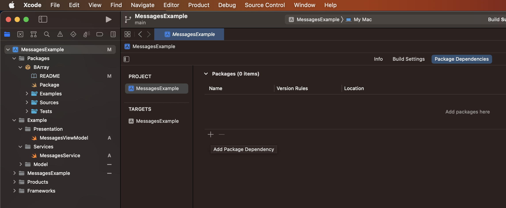
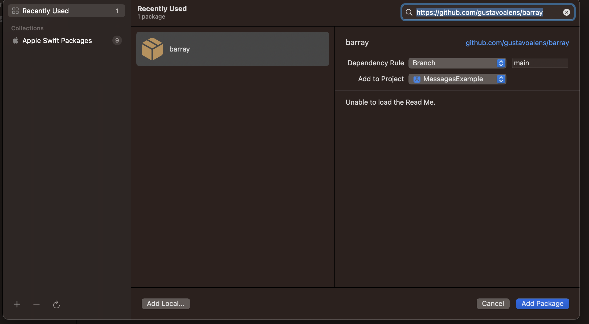

# BArray

BArray is a simple framework to dealing with Binary Search using Generics to implement from any Comparable Struct or Class.
The BArray aims to simplify the implementation (where is just needed to your struct implements the respective protocol) and guarantee the sort of data if needed.

# Add BArray

BArray can be added to your project by **Swift Package Manager (SPM)**.

If you have to add as dependency in a package, you can follow the example below in your manifest (package.swift):

```swift

import PackageDescription

let package = Package(
    name: "yourPackageName",
    products: [
        .library(
            name: "YourPackageName",
            targets: ["YourPackageName"]),
    ],
    dependencies: [
		{another packages},
        .package(url: "https://github.com/gustavoalens/barray", branch: "main")
    ],
    targets: [
        .target(
            name: "YourPackageName",
            dependencies: [
              .product(name: "BArray", package: "BArray"),
            ]),
        .testTarget(
            name: "YourPackageNameTests",
            dependencies: ["YourPackageName"]),
    ]
)

```

or to your project:
Go to your project Package Depedencies

And then add BArray



# Example

You can find a example in this repository in Example folder

## Chat Example

Imagining a simple ViewModel for a Chat App, we can use the BArray to search messages to user have interacted with

```swift
import BArray

final class MessagesViewModel {
    private let service = MessagesService()
    private var messages = BArray<Message>(initialValues: [])
    
    private let chatID: Int
    
    init(chatID: Int) {
        self.chatID = chatID
    }
    
    func getMessages() async {
        messages.insert(contentsOf: await service.getMessages(for: chatID))
    }
    
    func deleteOnList(message: Message) {
        messages.remove(item: message)
    }
    
    func deleteForEveryone(message: Message) {
        message.status = .deleted
    }
    
    func newMessage(message: Message) {
        messages.insert(message)
    }
}
```

And to control the order and search, we can use the message identification or date, like:

```swift
import BArray
import Foundation

final class Message {
    let msgID: Int
    let date: Date
    let text: String
    let authorID: Int
    var status: MessageStatus
    
    init(msgID: Int, date: Date, text: String, authorID: Int, status: MessageStatus) {
        self.msgID = msgID
        self.date = date
        self.text = text
        self.authorID = authorID
        self.status = status
    }
}

enum MessageStatus {
    case sended
    case received
    case readed
    case deleted
}

extension Message: BArrayData {
    var id: Date { date } // id can be any Comparable, like Date, Int or custom Struct thats implements Comparable
}
```


